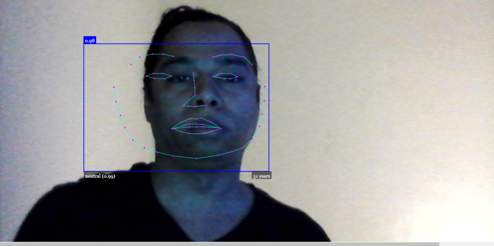
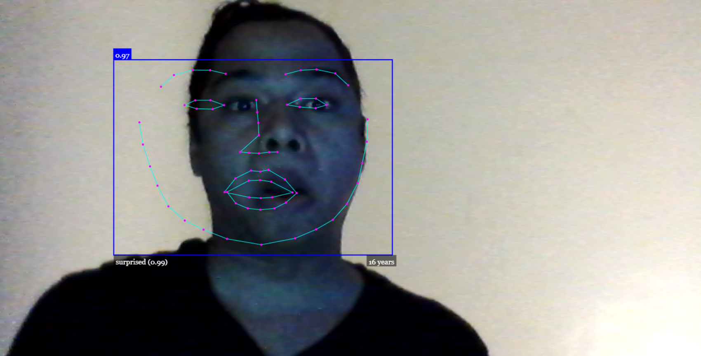
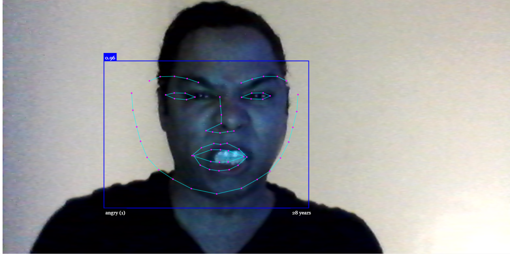
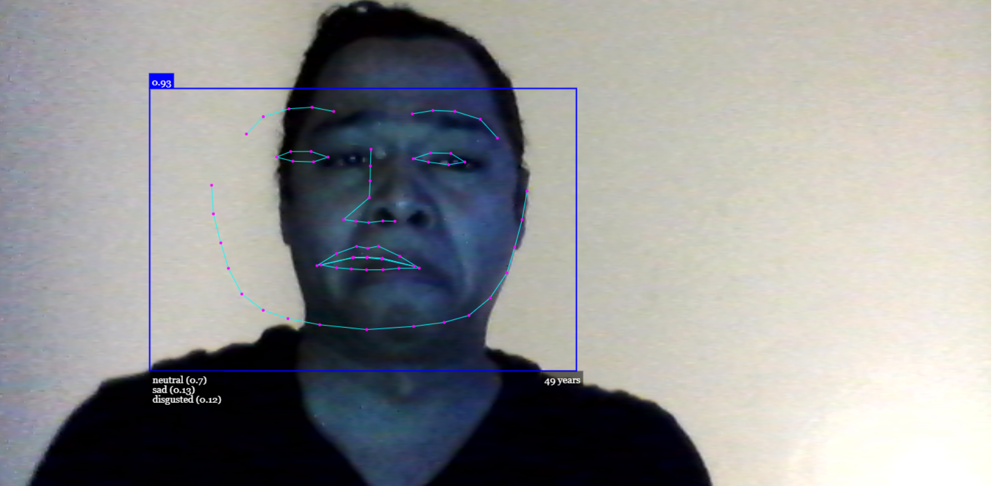

# face-detection-app

I did this project because I wanted to work with AI. I chose the face api because I hear it's really popular and easy to work with. This project wasn't too difficult but I definitely had a few snags but I toughed it out and I'm a better software engineer because of it.

## Environment Setup

1. Clone my repo at https://github.com/davidmstanleyjr/face-detection-app
2. CD into and open the HTML file in your browser.

## Technologies Used

1. HTML
2. Javascript
3. Face api

## Issues

Reading the docs and figuring out how to implement all of the different features that api allows was kind of difficult, but I was able to figure it out. The logic was pretty straight forward. I created a video element in the html and made sure I passed everything through it so it would show up on the page. I had to figure out how to write logic for the app to constantly look for changes in the users facial expressions. That was tough but I have to refresh every 100 milliseconds. The age logic was tough to but I had it find every 30 predicted ages and return a median value. That's how I got the ages to be pretty accurate.

## Screenshots

!
[Screenshot 5](images/snip5.PNG)

## Live Page

Here is a link to the deployed site. https://davids-ai-facedetection.netlify.app/
